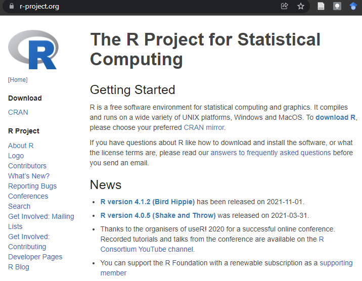
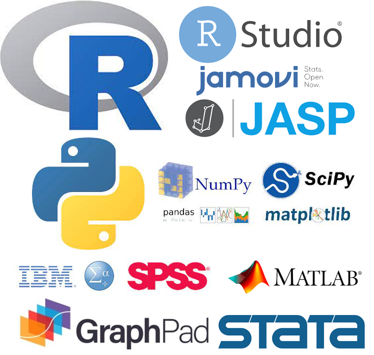

```{r setup, include=FALSE}
knitr::opts_chunk$set(echo = FALSE)
library(fontawesome)
library(emo)
```

# What is `r fa("r-project", fill = "steelblue")`?

As defined by The R Foundation, `r fa("r-project", fill = "steelblue")` is "a language and environment for statistical computing and graphics". In other words, you can use `r fa("r-project", fill = "steelblue")` to carry on a wide variety of stats, visualize data (in the most beautiful ways out there), as well as implement many other purposes extending beyond statistics (this html document and website was created using `r fa("r-project", fill = "steelblue")`!)

You can get `r fa("r-project", fill = "steelblue")` directly through [The R Project website](https://www.r-project.org/). In their homepage, they'll have listed the latest available version of R (4.1.2 "Bird Hippie" at the time of writing this post). `r fa("r-project", fill = "steelblue")` is available for the main operating systems (i.e., GNU/Linux, Windows, and macOS).


# Why `r fa("r-project", fill = "steelblue")`?
Is `r fa("r-project", fill = "steelblue")` the ultimate statistical software? Heck yeah! Is it the only option to do stats for your research or hobbies? No. 



There's quite a selection of software tools [available](https://en.wikipedia.org/wiki/List_of_statistical_software). I gravitate to R for the following reasons:

- Free

- Open source

- Extensible

- Statistical forward programming language (made by statistician for statistics)

- Great IDE integration (Hi there [RStudio!](https://www.rstudio.com/) `r emo::ji("smile")`)

> Congratulation! You are now ready to embark your data journey. Ya`r fa("r-project", fill = "steelblue")`! 