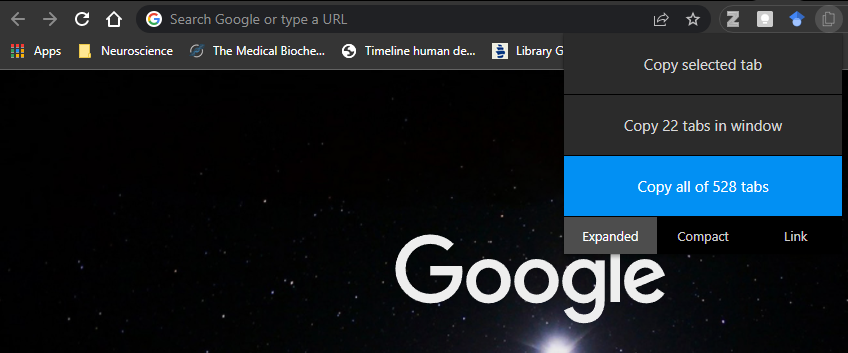

```{r metadata, message=FALSE, include=FALSE, echo=FALSE}
library(metathis)
meta() %>%
  meta_description(
    "Got 528 tab problems but defeat ain't one"
  ) %>%
  #meta_name("github-repo" = "jhelvy/jhelvy.com") %>%
  meta_viewport() %>%
  meta_social(
    title = "Got 528 tab problems",
    url = "https://www.juansanar.com/blog/2022-04-05-got-528-tab-problems",
    image = "https://www.juansanar.com/posts/2022-04-05-got-528-tab-problems/img/wordcloud-1.png",
    image_alt = "528 tabs in a single wordcloud",
    og_type = "website",
    og_author = c("Juan C. Sanchez-Arias"),
    twitter_card_type = "summary",
    twitter_creator = "@juan_sanar"
  )
```

```{css, echo=FALSE}
.spoiler {
  visibility: hidden;
}

.spoiler::before {
  visibility: visible;
  content: "Spoiler alert! Hover to see the answer."
}

.spoiler:hover {
  visibility: visible;
}

.spoiler:hover::before {
  display: none;
}
```

```{r setup, include=FALSE}
knitr::opts_chunk$set(echo = FALSE)
```



> How many times have you said to yourself: "I'll leave this X number of tabs open for now and will check them later to complete (insert task)?

The revolutionary introduction of tabs to browsers initiated by ["InternetWorks"](https://www.makeuseof.com/tag/which-browser-invented-tabs-3-common-myths-debunked/) (developed by BookLink Technologies) and popularized by Mozilla Firefox has allowed us since the early 2000's to open as many tabs as a user wants within a single browser window, limited only by the user's RAM and tolerability to unreadable tabs in the browser window. This combined with the increasingly available RAM in computers (my main desktop rig harbours 32 GB for example) and the expandability of desktops within the same operating system environment can quickly create a disaster of opened tabs if one doesn't pay attention to this matter.

As exemplified in the image above, I have fallen into the bottomless pit of multiple browsers, with multiple tabs across multiple desktop instances. The result: 528 tabs open. Yes, 528 tabs. Open. All the time. This also means I haven't shutdown my computer in a while and even when I did due to priority updates for Windows Security settings, I immediately restored my browser windows and all of its 528 tabs. 

> But why? What is the reason underlying this chaos!?

Without diving deep into melting pot inside my head, I'm confident such chaos is simply the product of **disorganization**,  more specifically, **disorganized thoughts and ideas**. These 528 tabs represent 528 thoughts and ideas that were not written down, categorized, and interconnected in a timely and structured fashion. In other words, I was using multiple tabs as a form of personal knowledge management system and -damn- it was an awful and terrible idea.

> Personal knowledge management? A [Personal Knowledgement Management (PKM)](https://en.wikipedia.org/wiki/Personal_knowledge_management) is a process of colelcting information in a structured manner so it is retrievable, shareable, and escalable. In simpler term, a system that can be used as your second brain. I will talk more abou this in separate posts.

<p class = "spoiler">I found a PKM that fits all my needs and sort of behaves like a brain that checks some of my favourite things: markdown-based, local first, and FOSS.</p>

It is [#TidyTuesday](https://twitter.com/hashtag/tidytuesday?src=hashtag_click) after all, so let's explore what were the most common words present in these open tabs.

### Packages to use

```{r set-up, include=TRUE, message=FALSE, warning=FALSE, echo=TRUE}
library(readr)
library(dplyr)
library(tidyr)
library(stringr)
library(tidytext)
```
### Loading data

I've been using [TabCopy](https://chrome.google.com/webstore/detail/tabcopy/micdllihgoppmejpecmkilggmaagfdmb) for most of my Chrome experience. It's a pretty useful extension that lets you copy the tabs that are open on a browser (and even across multiple browsers windows), which you can easily save in a text file and use in your favourite application. 

I copied the tabs using the TabCopy "Extended Format", where it generates a line with the name of the tab/website followed by the URL.

```{r load-data, include=TRUE, echo=TRUE, message=FALSE, warning=FALSE}
tabs <- read_csv("data/urls_2022-03-31.txt", col_names = FALSE)

tail(tabs)
```

The above output shows that each website's name is in **odd** rows with and URL's in **even** rows. Because I like data frames, I want to have a column (variable) with each website name and another column with its respective URL. An easy way to do this is by creating dummies indexes and sub-setting to wrangle the data frame with them. 

```{r dummie-indexes, include=TRUE, echo=TRUE}
seq(1, nrow(tabs),2) -> odd_indexes
seq(2, nrow(tabs),2) -> even_indexes

tabs_df <- data.frame(tabs[odd_indexes,], tabs[even_indexes,])
colnames(tabs_df) <- c("url_title", "url")

knitr::kable(tail(tabs_df))
```

Now that we have a tidy data frame, let's create a **wordcloud** with the help of `tidytext` and `wordcloud` packages and see what I have been reading heavily lately on the web.

```{r wordcloud, include=TRUE, echo=TRUE, warning=FALSE, message=FALSE}
text_df <- tibble(line = 1:371, text = tabs_df$url_title)

text_df %>% unnest_tokens(word, text) -> text_unnested

text_unnested %>%  filter(!word %in% c(
  "the", "and", "of", "in", "a",
  "to", "for", "1", "2", "at", "is",
  "are", "as", "b", "an", "on",
  "i", "by", "e", "it", "its", "etc"
  )) %>% count(word, sort = TRUE) -> text_unnested.filtered

wordcloud::wordcloud(words = text_unnested.filtered$word,
                     freq = text_unnested.filtered$n, 
                     min.freq = 1, max.words = 200, 
                     random.order = FALSE, rot.per = 0.35, 
                     colors = rev(viridis::magma(n = 131100)))
```

